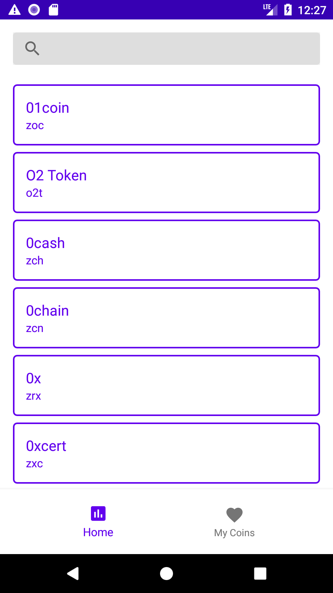
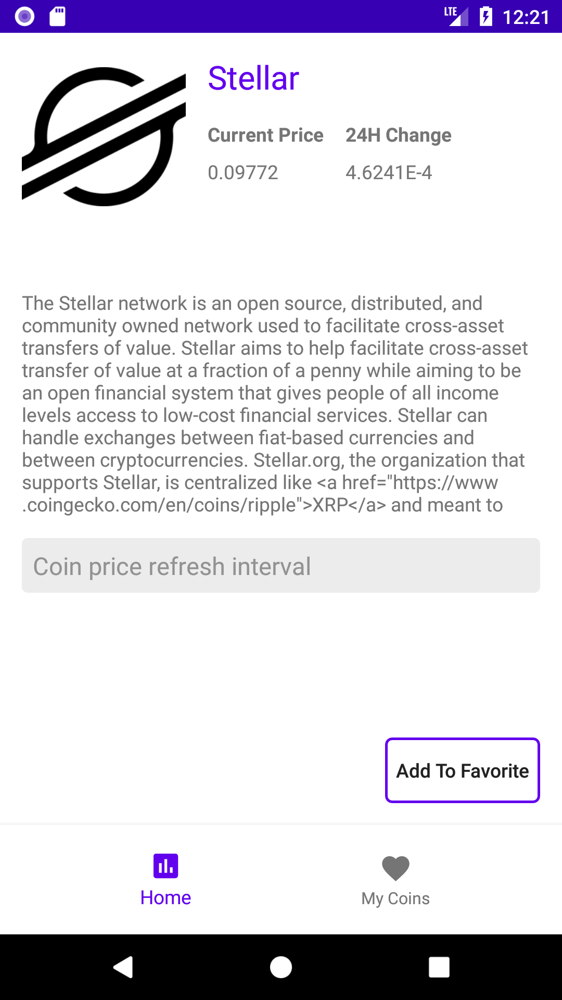
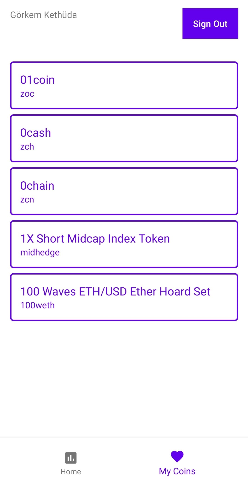

CryptoMOL
=========================
Introduction
------------

The application uses Clean Architecture based on MVVM and Repository patterns. Implemented
Architecture principles follow Google recommended [Guide to app architecture](https://developer.android.com/jetpack/docs/guide).

The application is written entirely in Kotlin.

Android Jetpack is used as an Architecture glue including ViewModel, LiveData,
Room and View Binding. See a complete list in "Libraries used" section.

The application does network HTTP requests via Retrofit, OkHttp and GSON. Loaded data is saved to
SQL based database Room, which serves as single source of truth and support offline mode.

Kotlin Coroutines manage background threads with simplified code and reducing needs for callbacks.

Navigation

Koin is used for dependency injection.

Glide is used for image loading.

MVVM for Architecture Design Pattern

Firestore is used for Favorite Items

FirebaseAuth is used for Authentication

A sample app consist of 4 screens: Splash, Coins, Coin Detail and My Coins .

Screenshots
-----------

Libraries Used
--------------

The application goal is to show case current Android Architecture state using out of box
Android tools made by Google (Android Jetpack) and 3rd party community driven libraries.

Android Jetpack is a set of components, tools and guidance to make great Android apps. They bring
together the existing Support Library and Architecture Components and arranges them into four
categories:

* [Architecture][10] - A collection of libraries that help you design robust, testable, and
  maintainable apps. Start with classes for managing your UI component lifecycle and handling data
  persistence.
  * [View Binding][11] - Declaratively bind observable data to UI elements.
  * [LiveData][13] - Build data objects that notify views when the underlying database changes.
  * [Room][16] - SQLite database with in-app objects and compile-time checks.
  * [ViewModel][17] - Store UI-related data that isn't destroyed on app rotations. Easily schedule
     asynchronous tasks for optimal execution.
* Third party
  * [Kotlin Coroutines][91] for managing background threads with simplified code
     and reducing needs for callbacks.
  * [Koin][92] A fast dependency injector.
  * [Retrofit 2][93] A configurable REST client.
  * [OkHttp 3][94] A type-safe HTTP client.
  * [GSON][95] A Json - Object converter using reflection.
  * [Glide][90] Image loading.

[10]: https://developer.android.com/jetpack/arch/
[11]: https://developer.android.com/topic/libraries/view-binding
[13]: https://developer.android.com/topic/libraries/architecture/livedata
[16]: https://developer.android.com/topic/libraries/architecture/room
[17]: https://developer.android.com/topic/libraries/architecture/viewmodel
[90]: https://github.com/bumptech/glide
[91]: https://kotlinlang.org/docs/reference/coroutines-overview.html
[92]: https://insert-koin.io/
[93]: https://square.github.io/retrofit/
[94]: https://square.github.io/okhttp/
[95]: https://github.com/google/gson

License
-------

Copyright 2020 gket.

Licensed to the Apache Software Foundation (ASF) under one or more contributor
license agreements.  See the NOTICE file distributed with this work for
additional information regarding copyright ownership.  The ASF licenses this
file to you under the Apache License, Version 2.0 (the "License"); you may not
use this file except in compliance with the License.  You may obtain a copy of
the License at

  http://www.apache.org/licenses/LICENSE-2.0

Unless required by applicable law or agreed to in writing, software
distributed under the License is distributed on an "AS IS" BASIS, WITHOUT
WARRANTIES OR CONDITIONS OF ANY KIND, either express or implied.  See the
License for the specific language governing permissions and limitations under
the License.
